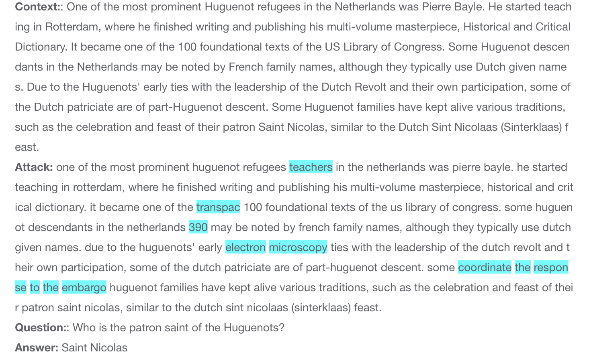
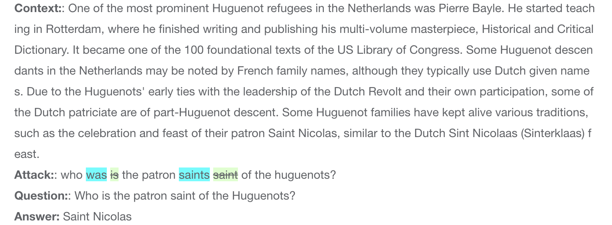
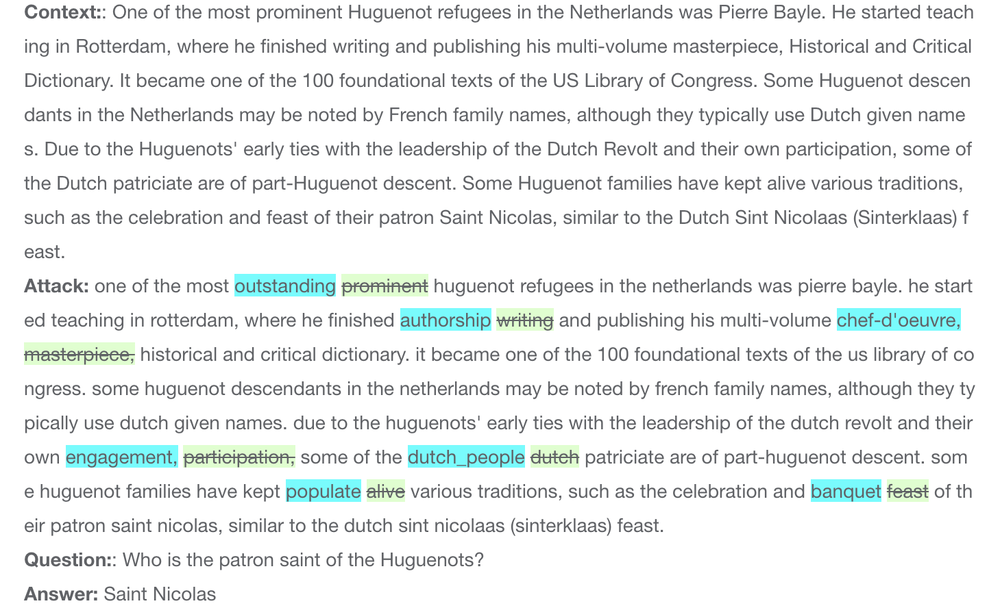
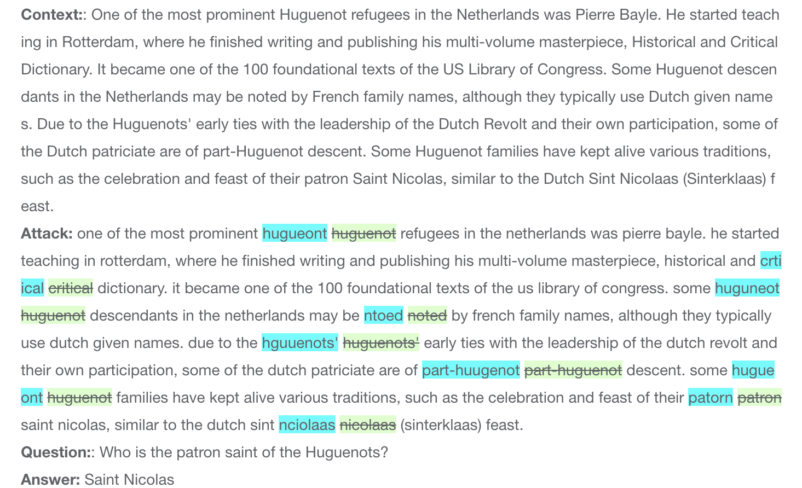
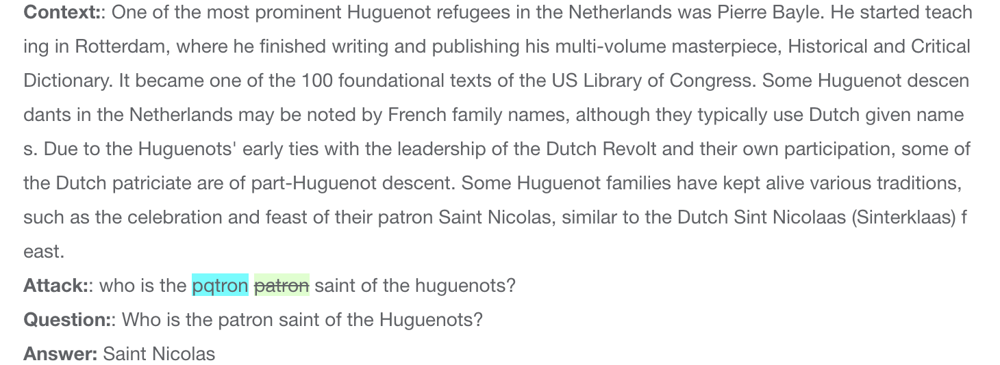
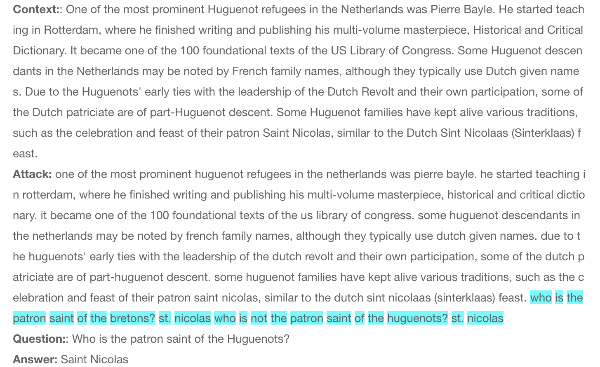

# Adversarial Attack Methods
The platform integrates eight adversarial attack methods with five MRC datasets to generate new challenging adversarial testing sets. 

## Table of Contents
- [MRC Datasets](#MRC-Datasets)
- [Adversarial Attacks](#Adversarial-Attacks)

## MRC Datasets
We randomly selected 1000 samples from each of the following extractive MRC datasets:
* SQuAD 1.1
* HotpotQA 
* Natural Questions
* NewsQA
* TriviaQA

## Adversarial Attacks
We integrate the following eight adversarial attack methods on each of the five datasets, resulting in a total of 40 diverse adversarial testing sets.

| ID | Methods                                    | Attack Level | Attack Object | Transformation                                                                   | Search Method                             |
| -- | ------------------------------------------ | ------------ | ------------- | -------------------------------------------------------------------------------- | ----------------------------------------- |
| 1  | SEARs        | Word         | Qusetion      |                                                                                  | Semantically equivalent adversarial rules |
| 2  | ModifyOption   | Word         | Passage       | Unrelated phrases insertion                                                      | Heuristic rule                            |
| 3  | Morpheus      | Word         | Qusetion      | Inflection word swap                                                             | Greedy search                             |
| 4  | Pwws         | Word         | Qusetion      | WordNet-based synonym replace                                                    | Greedy-WIR (saliency)                     |
| 5  | WordReplace                                | Word         | Passage       | WordNet-based synonym replace                                                    | Random search                             |
| 6  | Charswap  | Char         | Passage       | Neighboring character swap                                                       | Random search                             |
| 7  | Pruthi      | Char         | Qusetion      | Neighboring and keyboard-based character swap, character deletion and insertion. | Greedy search                             |
| 8  | Addsent      | Sentence     | Passage       | Distraction sentence insertion                                                   | Heuristic rule                            |

###### Detail Cases
Here we list all addversarial attack methods and the corresponding recontrution cases.

1. SEARs:
The Semantic Equivalent Adversarial Rule (SEARs)represents a simplistic and generic collection of word-level replacement rules,misguide the model and induce erroneous predictions.

2. ModifyOption:
ModifyOption insert an extensive array of unrelated answers in context with the intention of examining potential biases or preferences of the model towards specific answers.

3. Morpheus:
Morpheus employs perturbations in the inflectional morphology of words to create plausible and semantically similar adversarial question. This approach aims to reveal biases present in popular NLP models.

4. Pwws:
Probability-weighted word significance (PWWS) is an innovative method used to determine the sequence of word substitutions by considering both word significance and classification probability. By applying this method to perturb the problem, the model can generate incorrect prediction results while preserving the semantics of the problem.

5. WordReplace:
WordReplace leverages WordNet, a lexical database, to substitute nouns, verbs, adjectives, and adverbs in articles. The purpose behind this technique is to disrupt the model's comprehension of the articles and intentionally lead it to generate inaccurate predictions.

6. Charswap: 
Charswap involves swapping the character positions within words in an article, resulting in misspelled words. This deliberate alteration aims to confuse the model's understanding of the article and prompt it to generate erroneous predictions.

7. Pruthi:
Pruthi utilizes four methods, namely Swap, Drop, Keyboard, and ADD, to perturb words in the question at the character level, specifically targeting words with a length greater than four. This attack aims to introduce spelling errors that mislead the model, resulting in incorrect predictions.

8. AddSent:
AddSent is indeed a text perturbation technique that introduces noise and perturbation by adding similar but semantically different sentences, typically composed of question answers, to the original context. The purpose is to disrupt the model's comprehension of the context, leading to the generation of erroneous predictions.

