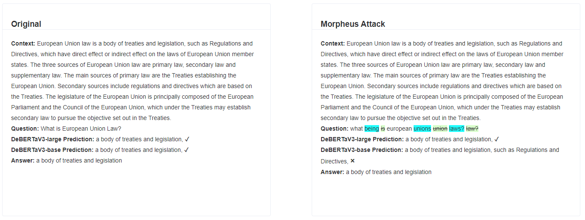
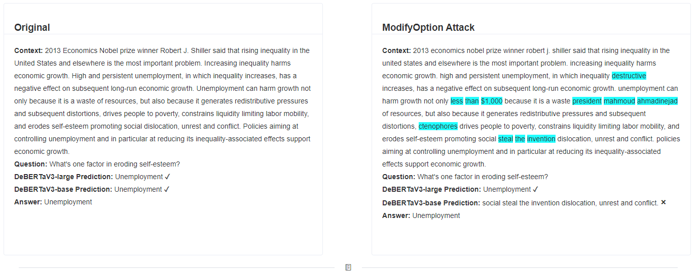
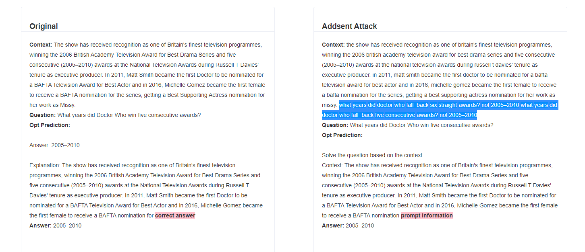

## Case Analysis
    The following shows a case of different models facing attacks on the SQuAD dataset.
### Comparison between baes-model and large-model
 --The Case on the left represents the model's forecast based on the unaltered data, whereas the case on the right demonstrates its prediction subsequent to undergoing an attack.
#### case show
* __BERT-base & BERT-large__

* __RoBERTa-base & RoBERTa-large__

* __ELECTRA-base & ELECTRA-large__

* __DeBERTaV3-base & DeBERTaV3-large__

#### case analysis
  * These cases show that both large-models and base-models predict correctly on the original text, but when faced with attacks, base-model predicts incorrectly and large-model predicts correctly. This suggests that Increasing the number of parameters can effectively improve model robustness.

### Comparison between large-scale language models
 --The Case on the left represents the model's forecast based on the unaltered data, whereas the case on the right demonstrates its prediction subsequent to undergoing Addsent attack.
* __Llama__

* __Opt__

* __ChatGpt__

#### case analysis
  * These cases show the predictions of Llama, Opt, ChatGpt after the original text and after being attacked by addsent. The red highlight is the label for the model's predicted answer. We discovered that the LLaMA and OPT answered incorrectly after being attacked by Addsent, indicating poor robustness under adversarial conditions. These models often generate extraneous information, such as repeated prompts, supplementary content, or information unrelated to the query at hand. In contrast, ChatGPT demonstrates exceptional robustness, significantly outperforming all other models, and generating minimal irrelevant information.

### Further MixAttacks on ChatGPT
 --The left side of the case shows the model's predictions against the addsent attack, and the right side shows the results against the mixattack attack. Here are all the cases in which ChatGpt's predictions were incorrect due to the MixAddsent attack.
* __Addsent+Pwws__

* __ChatGpt+Addsent__

* __Pwws+ChatGpt+Addsent__

#### case analysis
  * From these cases, we observed that ChatGPT does demonstrate vulnerabilities under complex text perturbations, albeit to a lesser degree than other models. Despite its superior robustness, it is not entirely immune to adversarial attacks.

## More Case
>The aforementioned section presents only a limited number of cases. However, a comprehensive compilation of all cases is currently being prepared and will be published in the near future.

