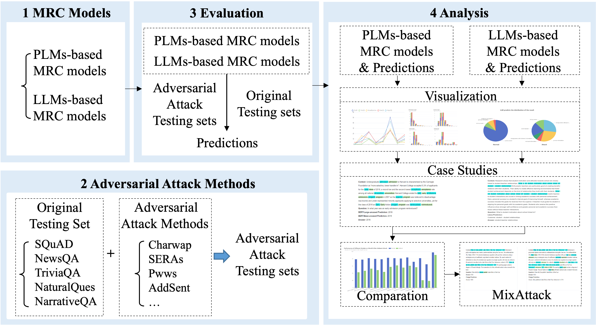

# Robustness-Eva-MRC

Robustness-Eva-MRC, is a platform that explores the robustness of both pre-train language models (PLMs) and three large-scale language models (LLMs) in the extractive machine reading comprehension (MRC) task. 

The platform conducts an in-depth analysis of five PLMs and three LLMs——specifically, LLaMA, OPT, and ChatGPT——under various adversarial attack scenarios to assess these models' robustness and language understanding capabilities.
The platform incorporates eight adversarial attack methods and five MRC datasets to generate new challenging adversarial testing sets. 
The platform then evaluates these models' performance on both the original and the newly generated adversarial attack sets, thereby providing a comprehensive measurement of their robustness based on prediction degradation.
Furthermore, our platform provides detailed visual analysis, along with case studies and comparative evaluations across a range of models, datasets, and adversarial attacks, offering a comprehensive assessment of their robustness.

The complete install and quick start documents are coming soon, and the demonstration video is available at [YouTube](https://www.youtube.com/watch?v=p0yO0n-iBz4&t=7s).

## Main Supported Functionality 
* **Adversarial Testing:** 
  The platform integrates everal MRC models based on PLMs and LLMs, eight adversarial attack methods and five MRC datasets to generate challenging adversarial testing sets. The performance of the models on both the original and newly generated adversarial attack sets are evaluated, offering a comprehensive measurement of their robustness based on prediction degradation.
* **Detailed Analysis & Visualization:** 
  Robustness-Eva-MRC provides a detailed visualization of results, and conducts case studies for assessing and evaluating the MRC models. 
  The platform allows users to compare the performance of different models across various datasets, and at different levels of granularity.
* **User-Friendly Interface:** 
  Provides interface to support new users’ model analysis.

We hope that the Robustness-Eva-MRC platform can provide a comprehensive evaluation platform to analyze the robustness of different MRC models against various adversarial attacks. 
It is also suited for those looking to compare and improve their own models' robustness.

## Overview Architecture

Our system consists of four main modules: 
* MRC Models
   * directly fetches the checkpoint files for MRC models directly from the HuggingFace repository. 
     * preloads five PLMs-based MRC models fine-tuned on the MRQA datasets: BERT, RoBERTa, ELECTRA, and DeBERTaV3, and UnifiedQA.
     * utilizs three LLMs-based in a conversational format: LLaMA-7B, OPT-6.7B, and ChatGPT.
* Adversarial Attack Methods
   * combines eight adversarial attack methods with five MRC datasets to generate new challenging adversarial testing sets, resulting in a total of 40 diverse adversarial testing sets.
   * provides a flexible interface to reconstruct new test sets that is interfered with by multiple attacks.
   * The complete attack description along with corresponding case examples are available at [Adversarial Attack Document]().
* Evaluation
   * evaluates the performance of the MRC models on both the original and adversarially perturbed datasets, and lists all results and supports illustrating each sample for a case study.
   * users can also download all kinds of test sets and upload their prediction files to the platform.
* Analysis 
   * Visualization for Single Model & Model Comparison
   * Case Studies for Single Model & Model Comparison
   * Mix Attack Analysis
  

The screenshots and additional external material are available at [screenshots]().

