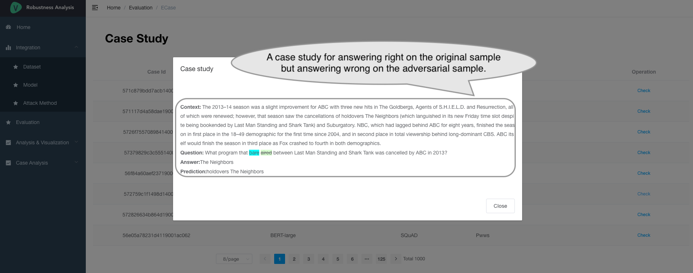
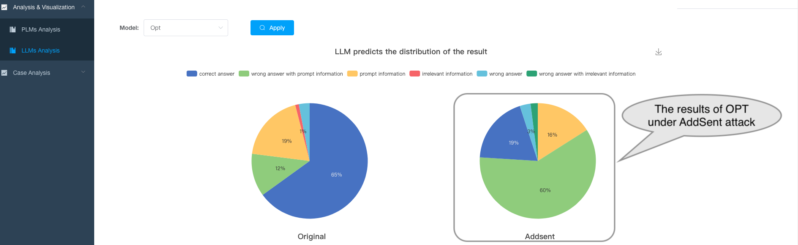
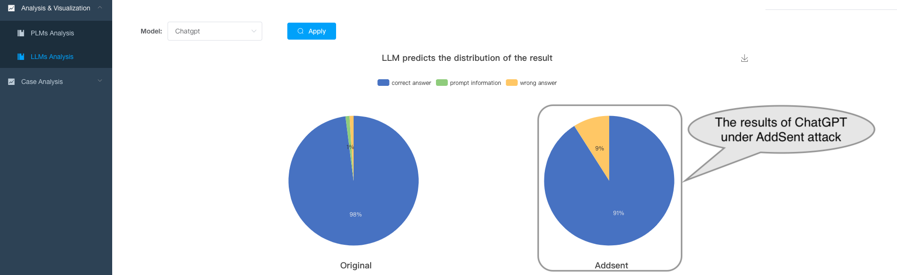

## How to Use
## Screenshots

## Table of Contents
- [MRC models](#MRC-models)
- [Adversarial Attack Methods](#Adversarial-Attack-Methods)
- [Evaluation](#evaluation)
- [Analysis](#Analysis)

Robustness-Eva-MRC, is a platform that explores the robustness of both pre-train language models (PLMs) and three large-scale language models (LLMs) in the extractive machine reading comprehension (MRC) task. 
The platform consists of four main modules: MRC Models, adversarial attack methods, evaluation, analysis.

## MRC Models
The first module is the MRC Models, which directly fetches the checkpoint files for MRC models directly from the HuggingFace repository. 
This module preloads five PLMs-based MRC models fine-tuned on the MRQA datasets and utilizs three LLMs-based in a conversational format.

It lists models's parameter scale and other information.

It also provides links to the hugging face of the corresponding model.

## Adversarial Attack Methods
This part combines eight adversarial attack methods with five MRC datasets to generate new challenging adversarial testing sets, resulting in a total of 40 diverse adversarial testing sets.

It use five extractive MRC datasets (SQuAD 1.1, HotpotQA , Natural Questions, NewsQA, TriviaQA) and lists their statistical information. 

Then it describes eight adversarial attack methods.

We also show the reconstruction method and detailed examples for each adversarial attack method.
This is a example case of WordReplace.

Besides, the platform provides the interface for generating new adversarial sets.

It provides a flexible interface to reconstruct new test sets that is interfered with by one or multiple attacks.

## Evauation

list all the results

show example case

   <!-- * evaluates the performance of the MRC models on both the original and adversarially perturbed datasets, and lists all results and supports illustrating each sample for a case study.
   * users can also download all kinds of test sets and upload their prediction files to the platform. -->

## Analysis 
   * Visualization for Single Model & Model Comparison
For pretrain language models:

For large-scale language models:

   * Case Studies for Single Model & Model Comparison

   * Mix Attack Analysis

