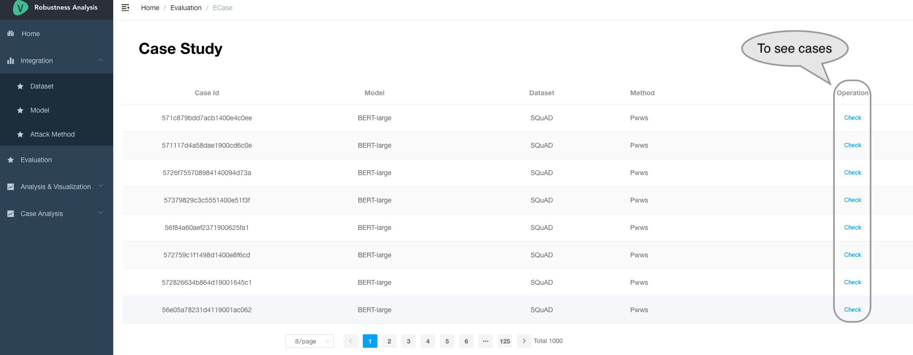
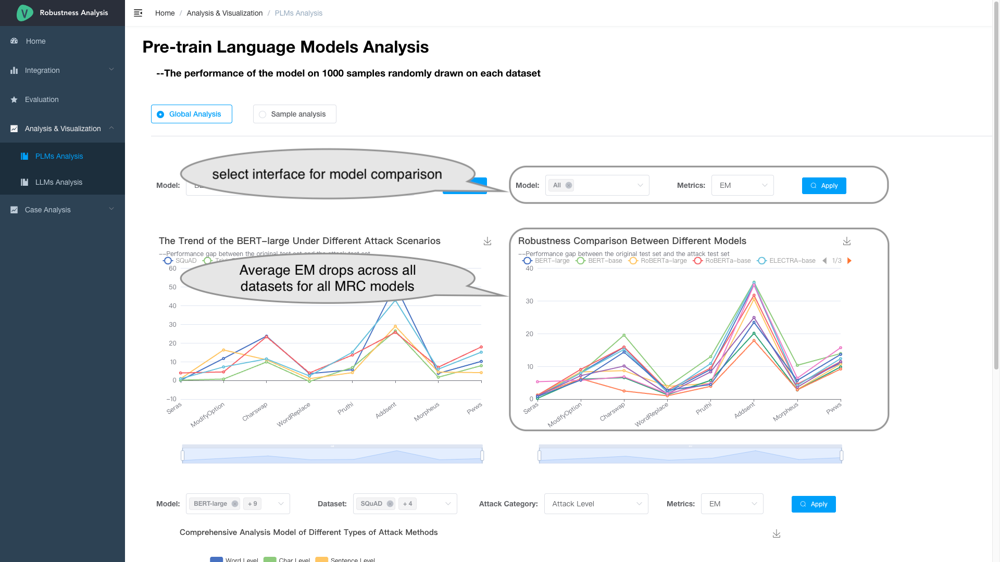
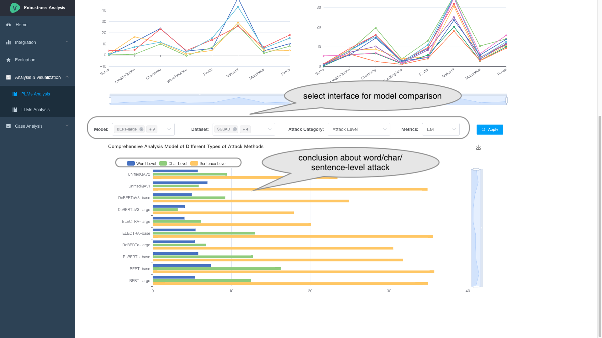
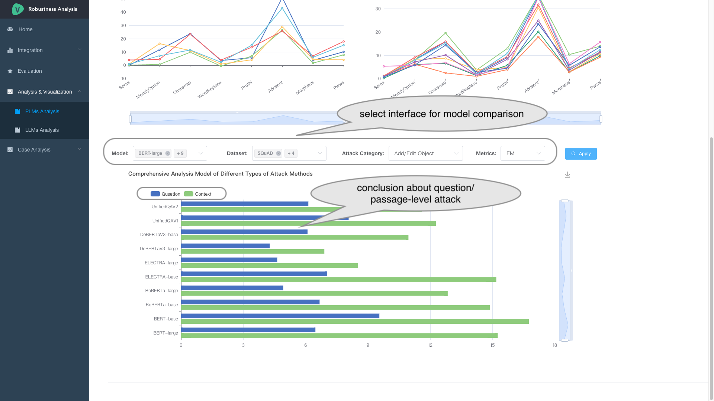
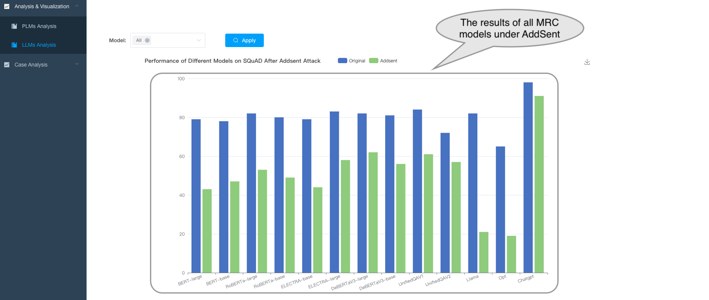
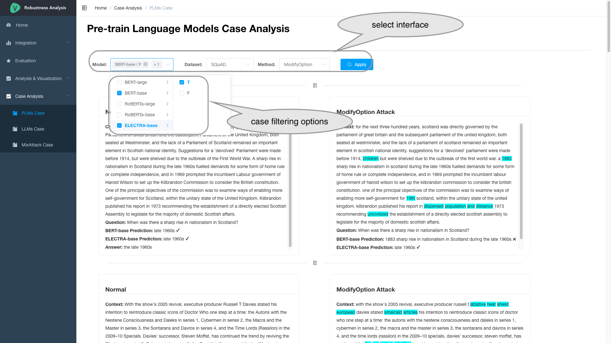

## How to Use
## Screenshots

## Table of Contents
- [MRC models](#MRC-models)
- [Adversarial Attack Methods](#Adversarial-Attack-Methods)
- [Evaluation](#evaluation)
- [Analysis](#Analysis)

Robustness-Eva-MRC, is a platform that explores the robustness of both pre-train language models (PLMs) and three large-scale language models (LLMs) in the extractive machine reading comprehension (MRC) task. 
The platform consists of four main modules: MRC Models, adversarial attack methods, evaluation, analysis.

## MRC Models
The first module is the MRC Models, which directly fetches the checkpoint files for MRC models directly from the HuggingFace repository. 
This module preloads five PLMs-based MRC models fine-tuned on the MRQA datasets and utilizs three LLMs-based in a conversational format.

It lists models's parameter scale and other information.

It also provides links to the hugging face of the corresponding model.

## Adversarial Attack Methods
This part combines eight adversarial attack methods with five MRC datasets to generate new challenging adversarial testing sets, resulting in a total of 40 diverse adversarial testing sets.

It use five extractive MRC datasets (SQuAD 1.1, HotpotQA , Natural Questions, NewsQA, TriviaQA) and lists their statistical information. 

Then it describes eight adversarial attack methods.

We also show the text modification method and detailed examples for each adversarial attack method.
This is a example case of WordReplace.

Besides, the platform provides the user interface to generate new adversarial sets by adjusting the corresponding attack methods and datasets.

It provides a flexible interface to generate new adversarial test sets that is interfered with by one or multiple attacks.

## Evauation
The platform shows the performances on different adversarial test sets, and provides complete case examples.

show example case

Besides, users can also download all kinds of tests sets and upload their prediction files to the platform.

   <!-- * evaluates the performance of the MRC models on both the original and adversarially perturbed datasets, and lists all results and supports illustrating each sample for a case study.
   * users can also download all kinds of test sets and upload their prediction files to the platform. -->

## Analysis 
### Visualization for pretrain language models
The platform plots the EM/F1 degradation rate across different adversarial sets for a series of attack types. 

The platform explores the relationship between the model's error distributions and various influential factors, including predicted answer length, article length, question length, and question type. 

Then we peroform model comparison.
The platform provides comparisons at different granularity levels, including various attack methods, attack levels, and edit levels, allowing users to choose their analysis of interest.

### Visualization for large-scale language models

### Case studies for pretrain and  large-scale language models
A wide range of case filtering options is provided, such as viewing instances where different models have succumbed to successful attacks. Users can select the specific cases they wish to analyze.

### Case studies of ChatGPT under MixAttack

