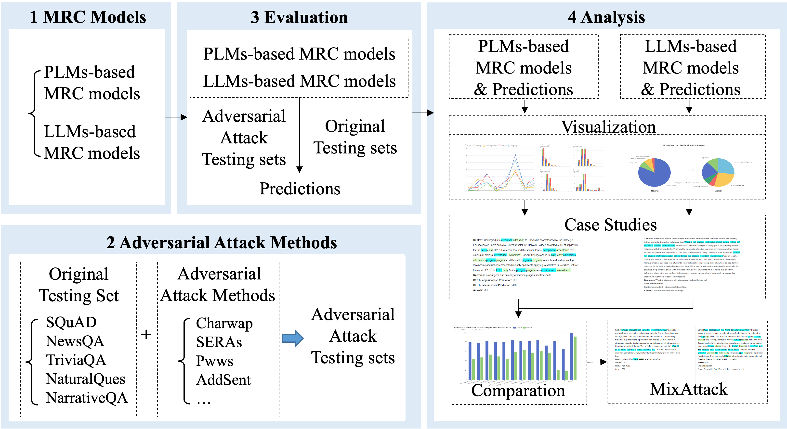

## How to Use
## Screenshots

## Table of Contents
- [MRC models](#MRC-models)
- [Adversarial Attack Methods](#Adversarial-Attack-Methods)
- [Evaluation](#evaluation)
- [Analysis](#Analysis)

Robustness-Eva-MRC, is a platform that explores the robustness of both pre-train language models (PLMs) and three large-scale language models (LLMs) in the extractive machine reading comprehension (MRC) task. 
The platform consists of four main modules: MRC Models, adversarial attack methods, evaluation, analysis.

## MRC Models
The first module is the MRC Models, which directly fetches the checkpoint files for MRC models directly from the HuggingFace repository. 
This module preloads five PLMs-based MRC models fine-tuned on the MRQA datasets and utilizs three LLMs-based in a conversational format, and lists their parameter scale.

## Adversarial Attack Methods
   * combines eight adversarial attack methods with five MRC datasets to generate new challenging adversarial testing sets, resulting in a total of 40 diverse adversarial testing sets.
   * provides a flexible interface to reconstruct new test sets that is interfered with by multiple attacks.
   * The complete attack description along with corresponding case examples are available at [Adversarial Attack Document](https://github.com/distantJing/Robustness-Eva-MRC/tree/main/Adversarial%20Attack%20Document).
## Evauation
   * evaluates the performance of the MRC models on both the original and adversarially perturbed datasets, and lists all results and supports illustrating each sample for a case study.
   * users can also download all kinds of test sets and upload their prediction files to the platform.
## Analysis 
   * Visualization for Single Model & Model Comparison
   * Case Studies for Single Model & Model Comparison
   * Mix Attack Analysis

